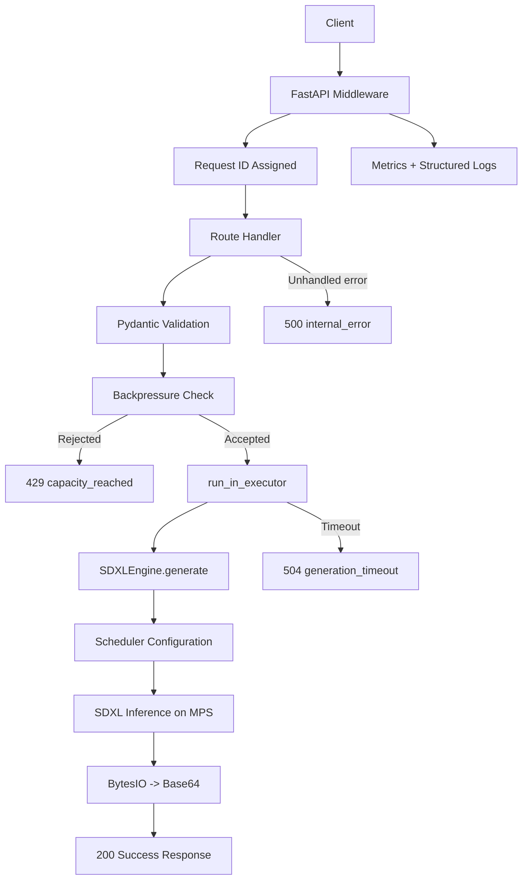
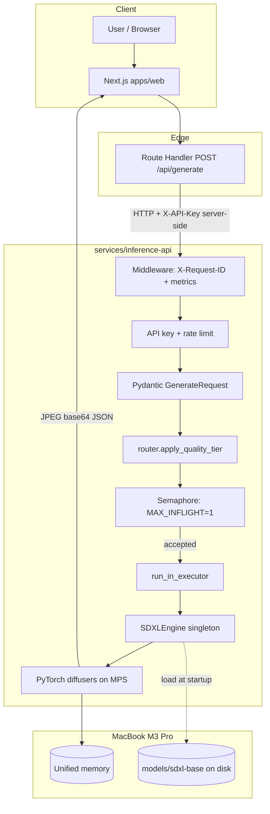
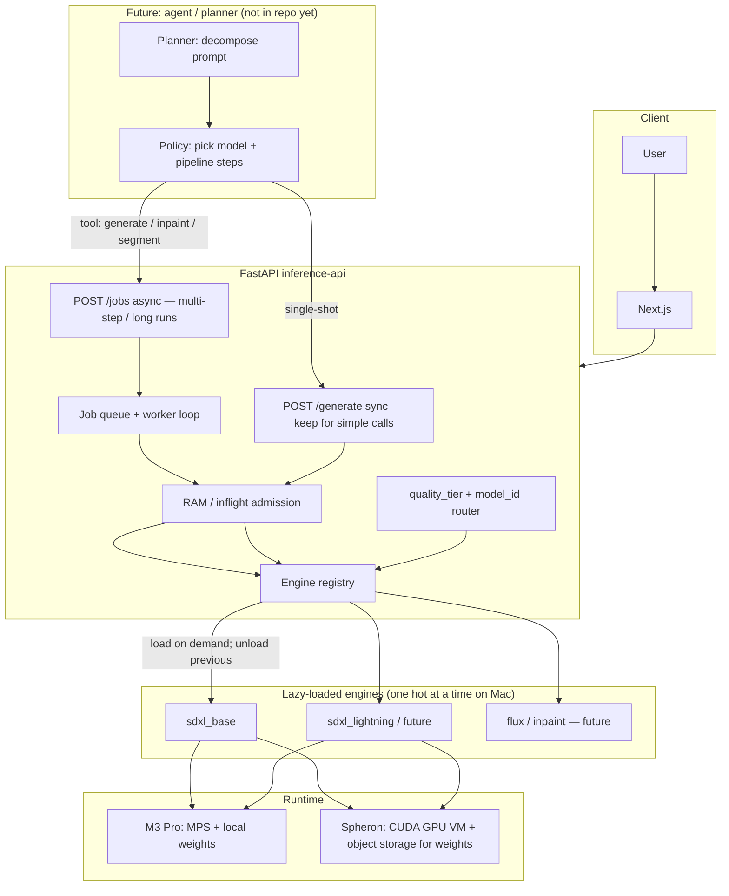
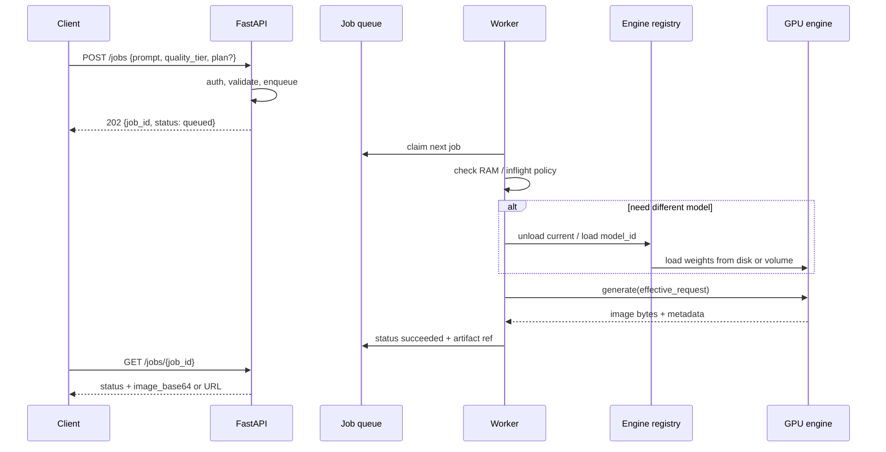

# SDXL API Architecture

## Overview

This project is a local-first SDXL image generation API built for Apple Silicon. The system is intentionally structured as a small, testable backend with clear boundaries between:

- request validation
- HTTP orchestration
- inference execution
- observability and failure handling

The repository is code-only. Model weights, generated images, caches, and local virtual environments are intentionally excluded from git history.

**Companion conventions:** Repo-wide rules for monorepo layout (Next.js + FastAPI), SEO/product boundaries, contract testing, and merge checklists live in `.cursor/rules/` — start with `quality-and-contracts.mdc` and `monorepo-layout.mdc`. This document focuses on the **inference service** runtime; those rules cover full-stack and process expectations.

## Current System Shape

### `services/inference-api/schemas.py`

Defines the API contracts:

- `GenerateRequest`
- `GenerateResponse`
- `ErrorResponse`

This layer protects the inference engine from invalid input shapes and keeps response/error formats explicit.

### `services/inference-api/engine.py`

Owns the SDXL runtime:

- loads the local SDXL model from `<repo root>/models/sdxl-base` (or `SDXL_MODEL_PATH`)
- keeps the pipeline in memory
- serializes mutable pipeline access with an internal lock
- returns image bytes through `io.BytesIO`

This module is the only place that should know about model internals.

### `services/inference-api/main.py`

Owns API orchestration:

- FastAPI route definitions
- request ID middleware
- metrics collection
- backpressure control
- timeout handling
- global error handling
- offloading blocking inference with `run_in_executor`

This file should remain focused on transport, policy, and observability rather than model logic.

### `services/inference-api/tests/test_integration_api.py`

Runs ASGI-level integration tests with mocked model execution. These tests validate:

- health endpoint behavior
- success response contract
- 401 API key authentication behavior
- 429 backpressure behavior
- 500 dev/prod error behavior
- 504 timeout behavior

This suite is the primary regression safety net for backend contract changes.

## Runtime Flow



## Request Lifecycle

### Success path

1. Client sends `POST /generate`.
2. Middleware assigns `request_id` and starts timing.
3. Request body is validated by `GenerateRequest`.
4. API checks generation capacity via semaphore.
5. If capacity is available, inference is offloaded to a worker thread.
6. `engine.generate()` configures scheduler and inference settings.
7. Output image is encoded in memory and returned as Base64 JSON.
8. Metrics and request logs are updated.

### Backpressure path

1. Client sends `POST /generate`.
2. Capacity check fails immediately.
3. API returns `429` with `error_code="capacity_reached"`.
4. Response includes `Retry-After` and `X-Request-ID`.

### Timeout path

1. Inference starts in a background thread.
2. API waits with `asyncio.wait_for(...)`.
3. If timeout threshold is exceeded, API returns `504` with `error_code="generation_timeout"`.
4. Inflight counters and semaphore are still released from `finally`.

### Internal error path

1. Unexpected exception occurs during request handling.
2. Global exception handler returns `500`.
3. In `dev`, response includes `details`.
4. In non-`dev`, internal details are hidden.

## Reliability Controls

### Non-blocking I/O

The web server does not run PyTorch inference directly in the event loop. Inference is offloaded with:

- `asyncio.get_running_loop()`
- `loop.run_in_executor(...)`

This keeps the FastAPI server responsive under blocking GPU work.

### Backpressure

Generation concurrency is explicitly bounded with:

- `MAX_INFLIGHT_GENERATIONS`
- a semaphore guarding `/generate`

This prevents unbounded pile-up of expensive inference requests.

### Timeout policy

Generation is bounded by:

- `GENERATION_TIMEOUT_SECONDS`

This prevents a single slow request from holding API capacity forever.

### Thread safety

The engine uses a lock around mutable pipeline operations:

- scheduler changes
- clip-skip related text encoder mutation

This is necessary because the diffusers pipeline is stateful.

## Observability

Current observability features:

- `X-Request-ID` on all responses
- structured log messages with request ID
- `/metrics` endpoint with request/generation counters
- explicit counters for:
  - total requests
  - inflight requests
  - accepted/rejected generation requests
  - timeout count
  - latency totals and averages

## Repository Rules

These are intentional product and collaboration decisions:

- `models/` is not tracked in git
- `generated/` is not tracked in git
- `__pycache__/` is not tracked in git
- collaborators must fetch model assets separately

Git is used for source, tests, and documentation. Large model binaries are outside repo scope.

## Current Product Stage

The backend is currently in the “reliable inference service” stage.

Completed capabilities:

- local SDXL inference
- validation contracts
- static API key authentication for `/generate` and `/metrics`
- backpressure
- timeout handling
- typed error responses
- integration tests

Completed since initial milestone list:

- per-key rate limiting
- `quality_tier` routing (`router.py`) with metadata (`model_id`, effective steps/CFG)
- Next.js web app with Route Handler proxy (`apps/web`)

Next planned milestones:

1. integration test for `quality_tier` end-to-end
2. lazy-loaded engine manager (one active model in RAM)
3. async job API (`POST /jobs`, `GET /jobs/{id}`) for multi-step flows
4. orchestration layer (agent/planner above inference; tool calls into engines)
5. production deploy on GPU cloud (e.g. Spheron) with CUDA backend abstraction

## End-to-end architecture (current vs target)

### Today (M3 Pro MVP — synchronous)



### Target (M3 Pro learning path → Spheron-ready)



### Request lifecycle (target async + lazy load)



## Tech debt (explicit)

| Area | What we have now | Debt if we rush multi-model / agents | Mitigation (do early) |
|------|------------------|--------------------------------------|------------------------|
| **Device** | Hard-coded `mps` in `engine.py` | Spheron uses **CUDA**; code paths diverge | `DEVICE` env (`mps` / `cuda` / `cpu`); single factory |
| **Model loading** | **Eager** singleton at import/startup | OOM if multiple pipelines; slow cold switch | `EngineRegistry` with `load(model_id)` / `unload()`; max one resident on Mac |
| **Routing** | `quality_tier` → steps/CFG only; always `sdxl_base` weights | “fast tier” without Lightning weights is misleading | Separate `model_id` from tier; honest 503 if weights missing |
| **API shape** | Sync `POST /generate` only | Long agent chains hit **timeouts** (90s) | Add **jobs** contract; keep `/generate` for single step |
| **Orchestration** | None (client → API) | Agent logic inside `main.py` | New module `orchestrator/` or external service; **tools** call inference API |
| **Artifacts** | Base64 in JSON | Huge payloads; bad for multi-step | Job result: file URL / object storage key on cloud |
| **Metrics** | Global counters | Cannot compare models/tiers | Label metrics by `model_id`, `quality_tier`, job status |
| **Health** | `optimization: lightning` vs **base** weights on disk | Ops confusion | Health reports `model_id`, `device`, `loaded_models` |
| **Deploy** | `make run` on laptop | No image, no GPU provider config | Dockerfile + `DEVICE=cuda` + model volume; Spheron deploy API for VM |
| **Tests** | Mocked engine | Registry/lazy load untested | Unit tests for router + registry; job state machine tests |

## MacBook M3 Pro (MVP) vs Spheron (production)

| Dimension | M3 Pro now | Spheron / GPU cloud later |
|-----------|------------|---------------------------|
| **Accelerator** | Apple **MPS** (unified memory) | NVIDIA **CUDA** (dedicated VRAM) |
| **Memory** | RAM shared with OS; easy **OOM** / swap | VRAM sized per instance (e.g. 24–80 GB); still need one-model discipline at first |
| **Concurrency** | Practically **1** heavy generation | Can raise inflight with bigger GPU; still queue for fairness |
| **Model storage** | `models/sdxl-base` local path | Download to volume on boot or pull from S3/R2; bake into image only if size acceptable |
| **Latency** | Cold MPS warmup; 20–60s+ for quality tiers | Often faster per step; pay for GPU minute |
| **Cost model** | CapEx (your machine) | Per-minute GPU; **lazy load** saves $ if instances stay up |
| **Agents** | Can run **locally** (small LLM) calling localhost API | Planner on CPU instance; inference on GPU instance (split services) |
| **Spheron fit** | N/A | Rent GPU VM, SSH or API deploy; optional Triton for multi-model serving at scale |

**Portable design rule:** keep **HTTP JSON contract** (`GenerateRequest`, `ErrorResponse`, job schemas) stable; swap **engine backend** and **storage** via env, not forks of `main.py`.

## How To Work On This Project

### Backend changes

Prefer editing:

- `services/inference-api/schemas.py` for API contract changes
- `services/inference-api/main.py` for routing, policy, and metrics
- `services/inference-api/engine.py` for inference/runtime behavior

### Before pushing

Run:

```bash
make test-integration
```

### When changing contracts

If you modify:

- error payload shape
- `/generate` success fields
- backpressure behavior
- timeout behavior
- metrics keys

then update:

- integration tests
- `README.md`
- this architecture document if the design meaning changed
