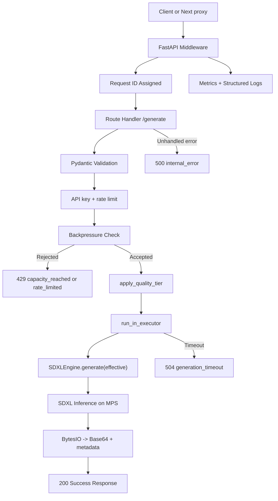
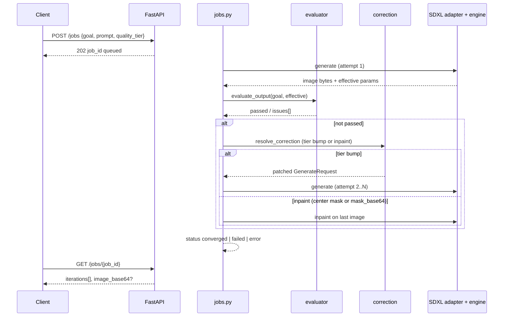
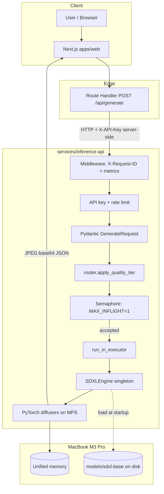
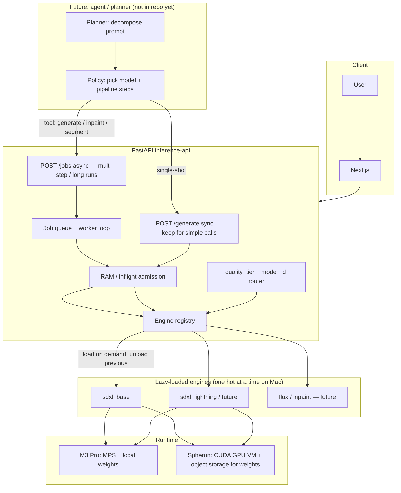
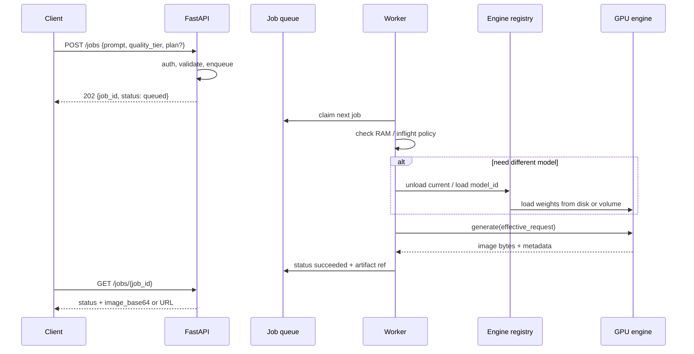

# SDXL API Architecture

## Overview

This project is a **monorepo**: a local-first SDXL image generation API (Apple Silicon / MPS) plus a **Next.js** client. The system is intentionally structured with clear boundaries between:

- request validation and routing policy
- HTTP orchestration (auth, limits, jobs — future)
- inference execution
- web UI and server-side proxy
- observability and failure handling

The repository is code-only. Model weights, generated images, caches, and local virtual environments are intentionally excluded from git history.

**Companion conventions:** Repo-wide rules for monorepo layout (Next.js + FastAPI), SEO/product boundaries, contract testing, and merge checklists live in `.cursor/rules/` — start with `quality-and-contracts.mdc` and `monorepo-layout.mdc`. This document focuses on the **inference service** runtime; those rules cover full-stack and process expectations.

**Low-level detail (classes, HTTP tables, sequences):** [LLD.md](./LLD.md).

## Current System Shape

### `services/inference-api/schemas.py`

Defines the API contracts:

- `GenerateRequest` (includes optional `quality_tier`)
- `GenerateResponse`
- `ErrorResponse`

This layer protects the inference engine from invalid input shapes and keeps response/error formats explicit.

### `services/inference-api/router.py`

Maps `quality_tier` (`fast` | `balanced` | `quality`) to concrete `steps` and `guidance_scale` before inference. Returns `(effective_request, model_id)`; today `model_id` is always `sdxl_base`. Does not load alternate checkpoints yet.

### `services/inference-api/engine.py`

Owns the SDXL runtime:

- loads the local SDXL model from `<repo root>/models/sdxl-base` (or `SDXL_MODEL_PATH`)
- keeps the pipeline in memory
- serializes mutable pipeline access with an internal lock
- returns image bytes through `io.BytesIO`

This module is the only place that should know about model internals.

### `services/inference-api/main.py`

Owns API orchestration:

- FastAPI route definitions
- request ID middleware
- metrics collection
- backpressure control
- timeout handling
- global error handling
- offloading blocking inference with `run_in_executor`

This file should remain focused on transport, policy, and observability rather than model logic.

### `apps/web/`

Next.js **Visual Studio** shell (shadcn/ui, Higgsfield-style bottom dock): `/` editor, `/explore` home. Server proxies:

- `POST /api/generate` → inference `/generate`
- `POST /api/jobs`, `GET /api/jobs/[jobId]` → inference `/jobs`

Secrets stay in `.env.local` (`SDXL_API_KEY`, `SDXL_API_URL`, `SDXL_JOBS_URL`). No torch in the browser.

**Deploy:** `scripts/spheron_deploy_web.sh` on GPU VM; `make spheron-deploy` from Mac. See [README.md](./README.md).

### `services/inference-api/tests/`

- `test_integration_api.py` — ASGI tests with mocked GPU (auth, rate limit, backpressure, 500/504, success contract).
- `test_router.py` — unit tests for `apply_quality_tier` (no GPU).

These suites are the primary regression safety net for backend contract changes.

## Runtime Flow (inference API)



## Request Lifecycle

### Success path

1. Client (or Next.js proxy) sends `POST /generate`.
2. Middleware assigns `request_id` and starts timing.
3. Request body is validated by `GenerateRequest`.
4. API key and per-key rate limit are enforced.
5. API checks generation capacity via semaphore.
6. `apply_quality_tier()` may override `steps` / `guidance_scale`; `model_id` is set for metadata.
7. If capacity is available, inference is offloaded to a worker thread with the **effective** request.
8. `engine.generate()` runs scheduler configuration and MPS inference.
9. Output image is encoded in memory and returned as Base64 JSON with metadata (`model_id`, `quality_tier`, effective steps/CFG, `seed`).
10. Metrics and request logs are updated.

### Backpressure path

1. Client sends `POST /generate`.
2. Capacity check fails immediately.
3. API returns `429` with `error_code="capacity_reached"`.
4. Response includes `Retry-After` and `X-Request-ID`.

### Timeout path

1. Inference runs on a **single-worker** GPU executor (one diffusion at a time).
2. API waits with `asyncio.wait_for(...)`.
3. On timeout, a cooperative **cancel flag** is set; `SDXLEngine` stops between diffusion steps via `callback_on_step_end`.
4. The API **awaits executor shutdown** (up to `GENERATION_CANCEL_GRACE_SECONDS`) before releasing the capacity semaphore, so the next request does not overlap on MPS.
5. Client receives `504` with `error_code="generation_timeout"`.

### Internal error path

1. Unexpected exception occurs during request handling.
2. Global exception handler returns `500`.
3. In `dev`, response includes `details`.
4. In non-`dev`, internal details are hidden.

## Reliability Controls

### Non-blocking I/O

The web server does not run PyTorch inference directly in the event loop. Inference is offloaded with:

- `asyncio.get_running_loop()`
- `loop.run_in_executor(...)`

This keeps the FastAPI server responsive under blocking GPU work.

### Backpressure

Generation concurrency is explicitly bounded with:

- `MAX_INFLIGHT_GENERATIONS`
- a semaphore guarding `/generate`

This prevents unbounded pile-up of expensive inference requests.

### Timeout policy

Generation is bounded by:

- `GENERATION_TIMEOUT_SECONDS` (env, default `90`)

This prevents a single slow request from holding API capacity forever.

**Important:** `asyncio.wait_for` stops the HTTP wait; it does **not** cancel the GPU thread. See [Correction jobs](#correction-loop-first-mvp) and tech debt table.

### Thread safety

The engine uses a lock around mutable pipeline operations:

- scheduler changes
- clip-skip related text encoder mutation

This is necessary because the diffusers pipeline is stateful.

## Observability

Current observability features:

- `X-Request-ID` on all responses
- structured log messages with request ID
- `/metrics` endpoint with request/generation counters
- explicit counters for:
  - total requests
  - inflight requests
  - accepted/rejected generation requests
  - timeout count
  - latency totals and averages

## Repository Rules

These are intentional product and collaboration decisions:

- `models/` is not tracked in git
- `generated/` is not tracked in git
- `__pycache__/` is not tracked in git
- collaborators must fetch model assets separately

Git is used for source, tests, and documentation. Large model binaries are outside repo scope.

## Current Product Stage

The backend is currently in the “reliable inference service” stage.

Completed capabilities:

- local SDXL inference
- validation contracts
- static API key authentication for `/generate` and `/metrics`
- backpressure
- timeout handling
- typed error responses
- integration tests

Completed since initial milestone list:

- per-key rate limiting
- `quality_tier` routing (`router.py`) with metadata (`model_id`, effective steps/CFG)
- Next.js web app with Route Handler proxy (`apps/web`)
- lazy-loaded `EngineRegistry` (`registry.py`)
- integration test for `quality_tier` metadata
- **Correction loop MVP** — `POST /jobs`, `GET /jobs/{job_id}` (see below)
- **SDXL inpaint** — `POST /inpaint`, job-step inpaint via `goal.use_inpaint_correction` + optional `mask_base64` / auto center mask (`image_utils.py`)
- **`DEVICE` env** — `cuda` / `mps` / `cpu` (`device.py`); `/health` reports runtime device
- **Spheron runbooks** — `scripts/spheron_*.sh`, `make spheron-deploy`, `make deploy-api` / `make deploy-web` on VM
- **Studio UI refresh** — bottom dock, product job tab, lime theme (`apps/web/src/components/studio/`)

Next planned milestones:

1. **Benchmark evidence** — `make benchmark-product` / `make spheron-benchmark` on fixtures; record job loop vs baseline CLIP
2. **Reference-conditioned generation** — IP-Adapter / composite (reference today is CLIP-only, not pixel lock)
3. VLM rubric evaluator (composition, artifacts, readable text, etc.)
4. Thin planner LLM over fixed tools (goal → capability graph, not CFG knobs)
5. Persisted job store + artifact URLs (in-memory jobs lost on restart)

## Design layers (intent vs execution)

External reviews (May 2026) and product direction align on **four layers**. The planner must **not** encode per-model samplers or CFG; adapters do.

| Layer | Module(s) | Thinks in |
|-------|-----------|-----------|
| **Goal** | `schemas.VisualGoal`, job brief | `realism`, `preserve_product`, `task` |
| **Capability** | `capabilities.py` | `text_to_image`, `quality_tier_routing`, `inpainting` |
| **Policy** | `router.py`, `correction.py`, `quality_tier` | tier bumps, workflow retries |
| **Adapter** | `sdxl_adapter.py`, `engine.py`, `registry.py` | steps, CFG, scheduler for `sdxl_base` |

**Validation hypothesis (unproven):** closed-loop `generate → evaluate → correct` improves measurable quality on a **narrow** workflow. Until proven, avoid large planner/RAG systems.

## Correction loop (first MVP)

Stateful path for goal-seeking generation without holding a long HTTP connection on `/generate`.



| Status | Meaning |
|--------|---------|
| `converged` | Evaluator passed within `max_iterations` |
| `failed` | `error_code=convergence_failed` — no patch left or still failing |
| `error` | `generation_timeout`, `capacity_reached`, `internal_error`, etc. |

**Evaluator v0** — rule-based tier/steps vs `VisualGoal` (policy escalation).

**Evaluator v1 (product vertical)** — when `reference_image_base64` is set and `preserve_product` or `product_similarity_min` is set, runs **CLIP image–image similarity** (`clip_evaluator.py`, default threshold `0.85`). CLIP measures coarse similarity, not SKU geometry lock.

**Corrector (`resolve_correction`)** — tier bump on policy issues; on `product_similarity_low` with `goal.use_inpaint_correction` (and optional `mask_base64`), may schedule an **inpaint** step after attempt ≥ 2 using `StableDiffusionXLInpaintPipeline` (lazy-loaded). **Does not paste the reference JPEG into the scene.**

**Product expectation:** reference improves measurable CLIP and localized refinement; **faithful product composite** needs reference-conditioned generation (planned).

Stable error codes: `convergence_failed`, `job_not_found` (additive; do not rename without changelog).

### Benchmark harness (experimental proof)

Path: `benchmarks/product_similarity/` + `scripts/run_product_benchmark.py`.

For each manifest case with a fixture JPEG:

1. **Baseline** — one `POST /generate` → CLIP vs reference (computed in script).
2. **Job** — `POST /jobs` with `reference_image_base64` → poll → final CLIP + iteration log.

Outputs: `benchmarks/product_similarity/results/latest.json` and `latest.md` (gitignored). Use this to test the **unproven hypothesis**; do not treat positive `delta_clip` as product-market fit without human review.

## End-to-end architecture (current vs target)

### Today (M3 Pro MVP — synchronous)



### Target (M3 Pro learning path → Spheron-ready)



### Request lifecycle (target async + lazy load)



## Tech debt (explicit)

| Area | What we have now | Debt if we rush multi-model / agents | Mitigation (do early) |
|------|------------------|--------------------------------------|------------------------|
| **Device** | `DEVICE` env via `device.py` (done) | Multi-GPU routing not supported | Document per-host defaults in README |
| **Model loading** | `EngineRegistry` lazy per `model_id` | OOM if multiple pipelines; no unload yet | `unload()`; max one resident on Mac |
| **Routing** | `quality_tier` → steps/CFG only; always `sdxl_base` weights | “fast tier” without Lightning weights is misleading | Separate `model_id` from tier; honest 503 if weights missing |
| **API shape** | Sync `/generate` + in-process **jobs** (no external queue) | Jobs lost on restart | Persist job store; artifact URLs |
| **Correction** | Rules + CLIP + tier/inpaint on jobs | Inpaint does not composite reference SKU | IP-Adapter / mask composite; tune timeouts per host |
| **Orchestration** | None (client → API) | Agent logic inside `main.py` | New module `orchestrator/` or external service; **tools** call inference API |
| **Artifacts** | Base64 in JSON | Huge payloads; bad for multi-step | Job result: file URL / object storage key on cloud |
| **Metrics** | Global counters | Cannot compare models/tiers | Label metrics by `model_id`, `quality_tier`, job status |
| **Health** | `optimization: lightning` vs **base** weights on disk | Ops confusion | Health reports `model_id`, `device`, `loaded_models` |
| **Deploy** | README + `spheron_*` scripts (SSH/rsync) | No Dockerfile / IaC yet | Container image; health checks in orchestrator |
| **Tests** | Mocked engine | Registry/lazy load untested | Unit tests for router + registry; job state machine tests |

## MacBook M3 Pro (MVP) vs Spheron (production)

| Dimension | M3 Pro now | Spheron / GPU cloud later |
|-----------|------------|---------------------------|
| **Accelerator** | Apple **MPS** (unified memory) | NVIDIA **CUDA** (dedicated VRAM) |
| **Memory** | RAM shared with OS; easy **OOM** / swap | VRAM sized per instance (e.g. 24–80 GB); still need one-model discipline at first |
| **Concurrency** | Practically **1** heavy generation | Can raise inflight with bigger GPU; still queue for fairness |
| **Model storage** | `models/sdxl-base` local path | Download to volume on boot or pull from S3/R2; bake into image only if size acceptable |
| **Latency** | Cold MPS warmup; 20–60s+ for quality tiers | Often faster per step; pay for GPU minute |
| **Cost model** | CapEx (your machine) | Per-minute GPU; **lazy load** saves $ if instances stay up |
| **Agents** | Can run **locally** (small LLM) calling localhost API | Planner on CPU instance; inference on GPU instance (split services) |
| **Spheron fit** | N/A | Rent GPU VM, SSH or API deploy; optional Triton for multi-model serving at scale |

**Portable design rule:** keep **HTTP JSON contract** (`GenerateRequest`, `ErrorResponse`, job schemas) stable; swap **engine backend** and **storage** via env, not forks of `main.py`.

## How To Work On This Project

### Backend changes

Prefer editing:

- `services/inference-api/schemas.py` for API contract changes
- `services/inference-api/router.py` for tier → steps/CFG (policy; moves toward adapter)
- `services/inference-api/sdxl_adapter.py` for effective request + metadata
- `services/inference-api/evaluator.py` / `correction.py` for closed-loop policy patches
- `services/inference-api/jobs.py` for async correction jobs
- `services/inference-api/main.py` for routing, policy, and metrics
- `services/inference-api/engine.py` for inference/runtime behavior (SDXL adapter backend)
- `apps/web/src/app/api/*` and `apps/web/src/components/studio/*` for UI/proxy changes

### Before pushing

Run:

```bash
make test-integration
```

### When changing contracts

If you modify:

- error payload shape
- `/generate` success fields
- backpressure behavior
- timeout behavior
- metrics keys

then update:

- integration tests
- `README.md`
- this architecture document if the design meaning changed
