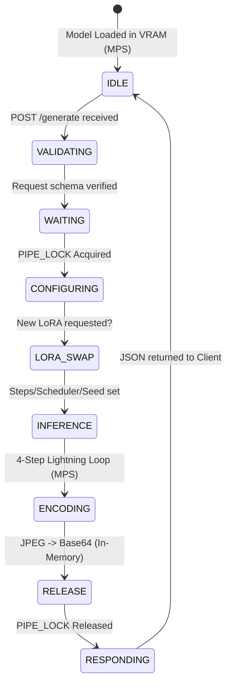

# SDXL-Lightning API: Architecture & Runbook

## 1. System Architecture (The "Factory" Model)
This API is designed as a **Headless, Stateless Monolith** optimized for Apple Silicon (MPS). It follows a strict separation of concerns to ensure that the GPU logic never blocks the web server.

### Component Map:
- **`schemas.py` (The Gatekeeper):** Uses Pydantic to enforce 2026-standard type safety. It prevents "GPU Poisoning" by rejecting invalid image dimensions or step counts before they reach the engine.
- **`engine.py` (The Powerhouse):** Manages the PyTorch lifecycle. It handles **Multi-Tenancy LoRA swapping** and ensures only one request touches the GPU at a time via a Threading Lock.
- **`main.py` (The Orchestrator):** A lean FastAPI wrapper that offloads heavy lifting to background threads, keeping the API responsive even during 100% GPU utilization.

---

## 2. The Request State Machine
This diagram tracks the lifecycle of a single image generation request.



---

## 3. Key AI Engineering Optimizations
1.  **Statelessness:** No images are written to the SSD. This prevents "Disk Thrashing" and keeps the system clean.
2.  **Unified Memory Management:** By using `torch.float16` and the `MPS` backend, we utilize the M3 Pro's 18GB Unified Memory efficiently without hitting the 12GB "VRAM" limit of standard GPUs.
3.  **Lightning Distillation:** Defaulted to 4 steps with 1.0 guidance scale. This provides a **10x speedup** over base SDXL while maintaining high quality.
4.  **Async/Threading Hybrid:** FastAPI handles the network (Async), while a dedicated thread pool handles the GPU (Blocking), ensuring "Non-Blocking IO."

---

## 4. Runbook (Operational Guide)

### Prerequisites
- Python 3.10+
- macOS (Apple Silicon M1/M2/M3)
- ~12GB of free Unified Memory

### Step 1: Environment Setup
```bash
# Create and activate virtual environment
python -m venv .venv
source .venv/bin/activate

# Install dependencies (ensure you have the latest diffusers and accelerate)
pip install fastapi uvicorn torch diffusers transformers accelerate pydantic pillow
```

### Step 2: Model Acquisition (If missing)
Ensure your `./models/sdxl-base` contains the `fp16` variant of SDXL-Lightning.
```python
from huggingface_hub import snapshot_download
snapshot_download(
    "ByteDance/SDXL-Lightning", 
    local_dir="./models/sdxl-base", 
    allow_patterns=["*fp16*"]
)
```

### Step 3: Starting the API
```bash
# Run with Uvicorn on all local interfaces
uvicorn main:app --host 0.0.0.0 --port 8000 --reload
```

### Step 4: Testing the Engine (CURL)
```bash
curl -X POST http://127.0.0.1:8000/generate \
-H "Content-Type: application/json" \
-d '{
  "prompt": "Anime style, a futuristic neon city, high quality, 8k",
  "steps": 4,
  "width": 1024,
  "height": 1024
}' > response.json
```

### Step 5: Monitoring
- **Memory:** Use `sudo powermetrics --samplers gpu_power` to monitor GPU/Memory pressure.
- **Logs:** Watch the terminal for `Unloading LoRA` / `Loading LoRA` messages during multi-tenant requests.
