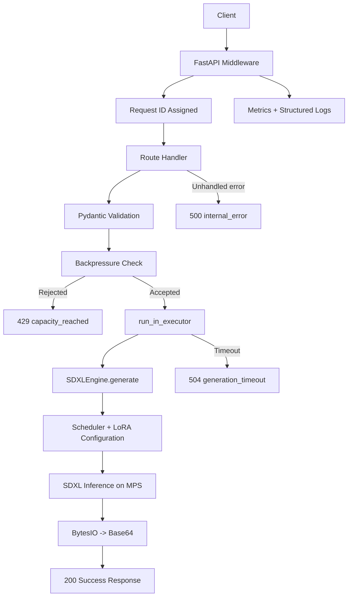

# SDXL API Architecture

## Overview

This project is a local-first SDXL image generation API built for Apple Silicon. The system is intentionally structured as a small, testable backend with clear boundaries between:

- request validation
- HTTP orchestration
- inference execution
- observability and failure handling

The repository is code-only. Model weights, generated images, caches, and local virtual environments are intentionally excluded from git history.

## Current System Shape

### `schemas.py`

Defines the API contracts:

- `GenerateRequest`
- `GenerateResponse`
- `ErrorResponse`

This layer protects the inference engine from invalid input shapes and keeps response/error formats explicit.

### `engine.py`

Owns the SDXL runtime:

- loads the local SDXL model from `./models/sdxl-base`
- keeps the pipeline in memory
- swaps LoRA adapters dynamically
- serializes mutable pipeline access with an internal lock
- returns image bytes through `io.BytesIO`

This module is the only place that should know about model internals.

### `main.py`

Owns API orchestration:

- FastAPI route definitions
- request ID middleware
- metrics collection
- backpressure control
- timeout handling
- global error handling
- offloading blocking inference with `run_in_executor`

This file should remain focused on transport, policy, and observability rather than model logic.

### `tests/test_integration_api.py`

Runs ASGI-level integration tests with mocked model execution. These tests validate:

- health endpoint behavior
- success response contract
- 429 backpressure behavior
- 500 dev/prod error behavior
- 504 timeout behavior

This suite is the primary regression safety net for backend contract changes.

## Runtime Flow



## Request Lifecycle

### Success path

1. Client sends `POST /generate`.
2. Middleware assigns `request_id` and starts timing.
3. Request body is validated by `GenerateRequest`.
4. API checks generation capacity via semaphore.
5. If capacity is available, inference is offloaded to a worker thread.
6. `engine.generate()` configures scheduler, LoRA, and inference settings.
7. Output image is encoded in memory and returned as Base64 JSON.
8. Metrics and request logs are updated.

### Backpressure path

1. Client sends `POST /generate`.
2. Capacity check fails immediately.
3. API returns `429` with `error_code="capacity_reached"`.
4. Response includes `Retry-After` and `X-Request-ID`.

### Timeout path

1. Inference starts in a background thread.
2. API waits with `asyncio.wait_for(...)`.
3. If timeout threshold is exceeded, API returns `504` with `error_code="generation_timeout"`.
4. Inflight counters and semaphore are still released from `finally`.

### Internal error path

1. Unexpected exception occurs during request handling.
2. Global exception handler returns `500`.
3. In `dev`, response includes `details`.
4. In non-`dev`, internal details are hidden.

## Reliability Controls

### Non-blocking I/O

The web server does not run PyTorch inference directly in the event loop. Inference is offloaded with:

- `asyncio.get_running_loop()`
- `loop.run_in_executor(...)`

This keeps the FastAPI server responsive under blocking GPU work.

### Backpressure

Generation concurrency is explicitly bounded with:

- `MAX_INFLIGHT_GENERATIONS`
- a semaphore guarding `/generate`

This prevents unbounded pile-up of expensive inference requests.

### Timeout policy

Generation is bounded by:

- `GENERATION_TIMEOUT_SECONDS`

This prevents a single slow request from holding API capacity forever.

### Thread safety

The engine uses a lock around mutable pipeline operations:

- scheduler changes
- LoRA load/unload
- clip-skip related text encoder mutation

This is necessary because the diffusers pipeline is stateful.

## Observability

Current observability features:

- `X-Request-ID` on all responses
- structured log messages with request ID
- `/metrics` endpoint with request/generation counters
- explicit counters for:
  - total requests
  - inflight requests
  - accepted/rejected generation requests
  - timeout count
  - latency totals and averages

## Repository Rules

These are intentional product and collaboration decisions:

- `models/` is not tracked in git
- `generated/` is not tracked in git
- `__pycache__/` is not tracked in git
- collaborators must fetch model assets separately

Git is used for source, tests, and documentation. Large model binaries are outside repo scope.

## Current Product Stage

The backend is currently in the “reliable inference service” stage.

Completed capabilities:

- local SDXL inference
- LoRA injection
- validation contracts
- backpressure
- timeout handling
- typed error responses
- integration tests

Next planned milestones:

1. API key authentication
2. per-key rate limiting
3. persisted generation history
4. async job model
5. frontend integration

## How To Work On This Project

### Backend changes

Prefer editing:

- `schemas.py` for API contract changes
- `main.py` for routing, policy, and metrics
- `engine.py` for inference/runtime behavior

### Before pushing

Run:

```bash
make test-integration
```

### When changing contracts

If you modify:

- error payload shape
- `/generate` success fields
- backpressure behavior
- timeout behavior
- metrics keys

then update:

- integration tests
- `README.md`
- this architecture document if the design meaning changed
