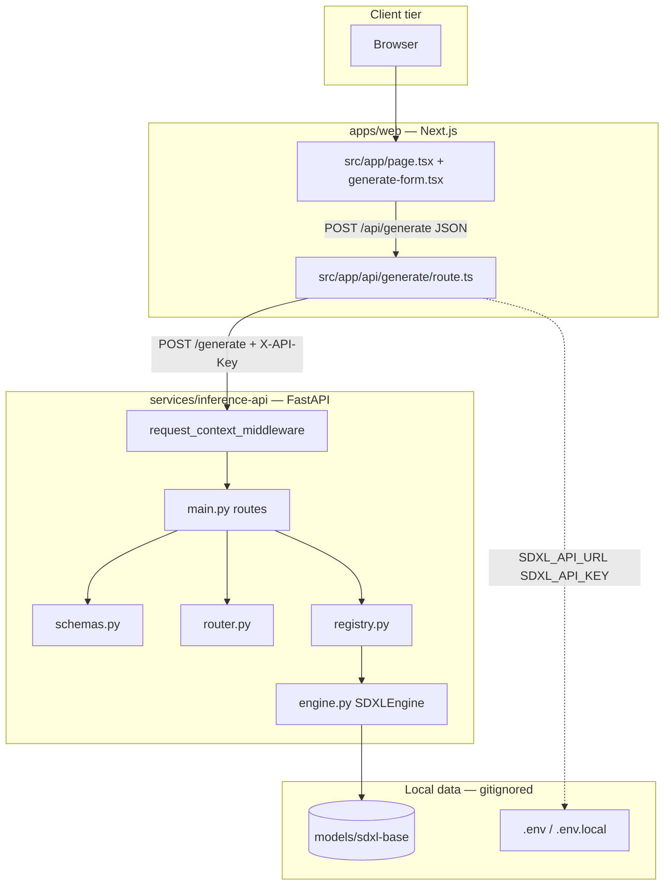
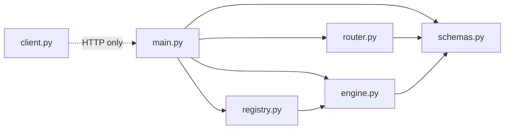
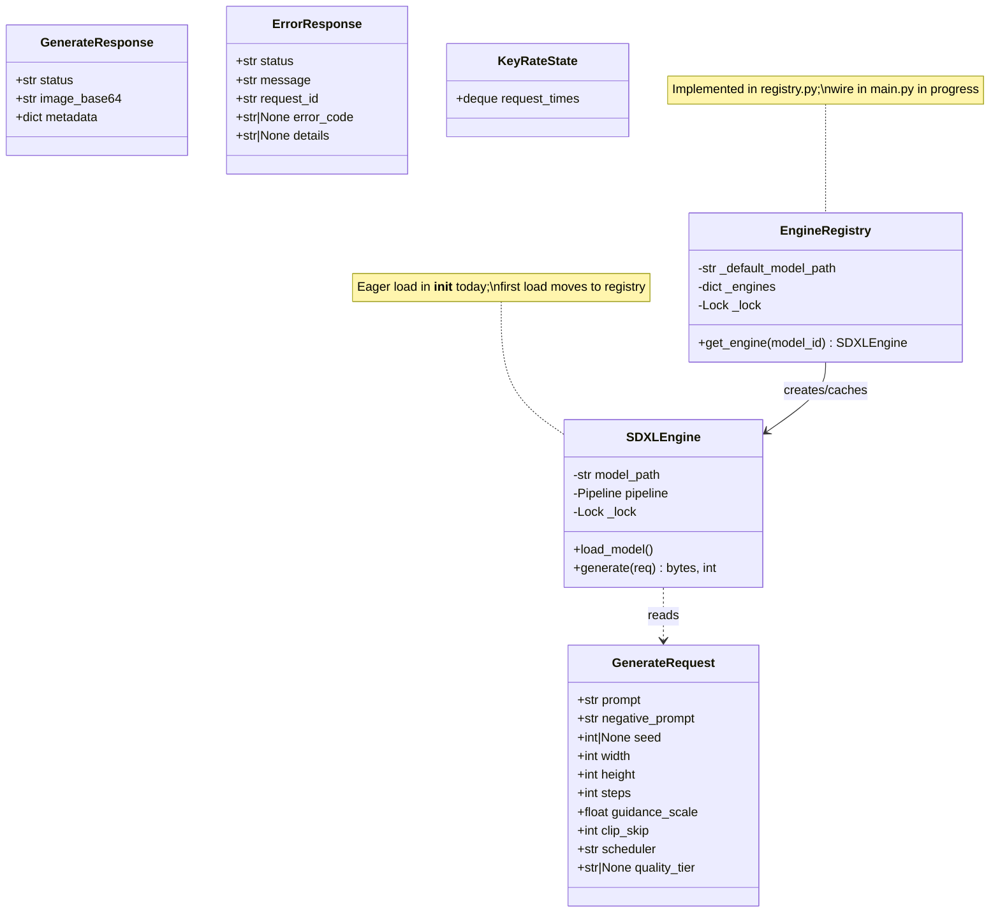
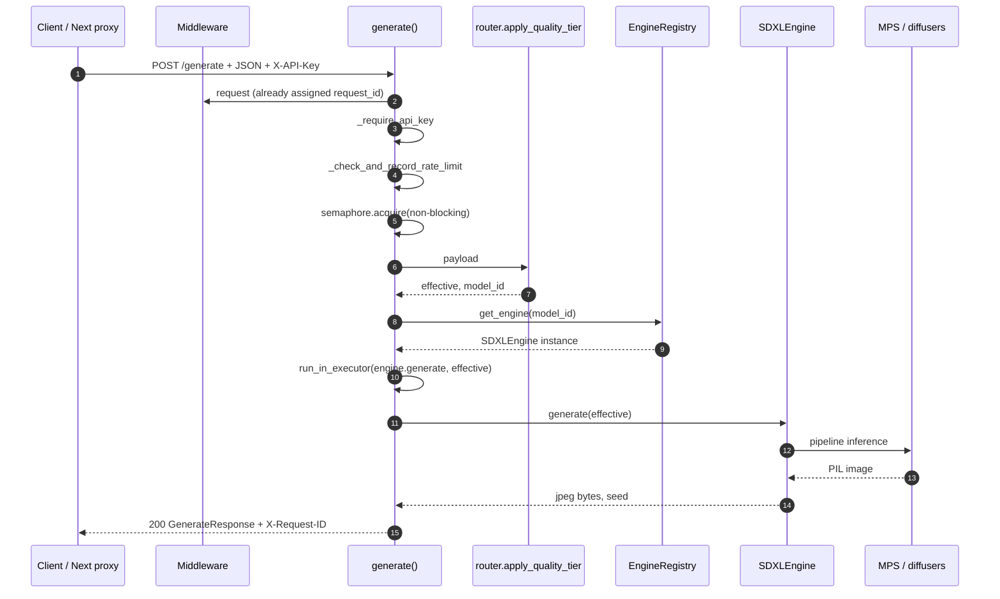
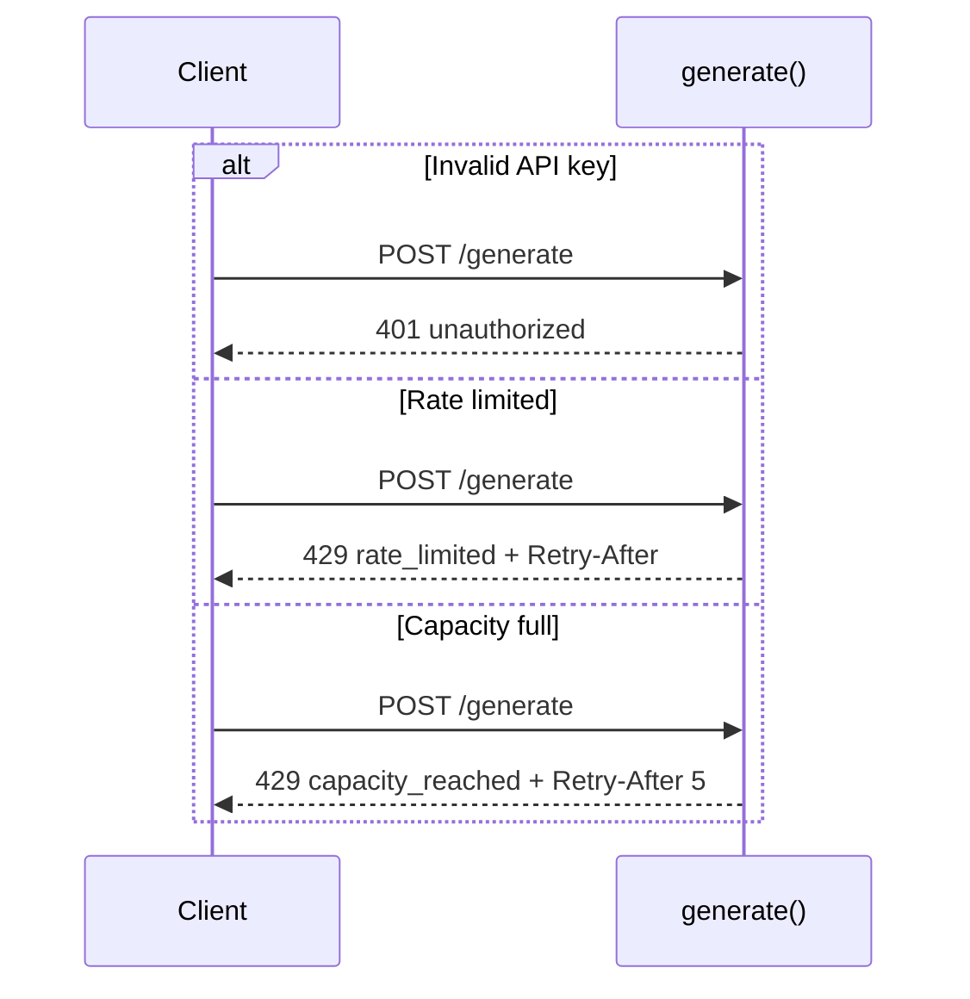
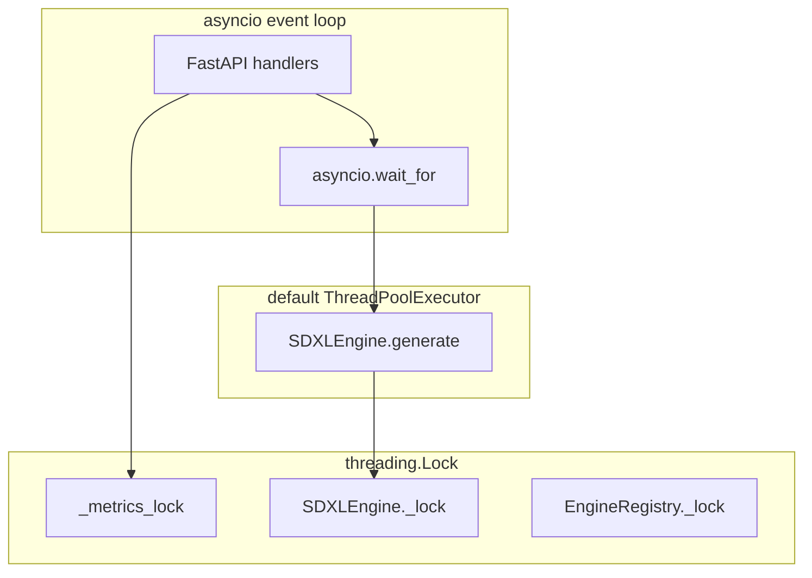
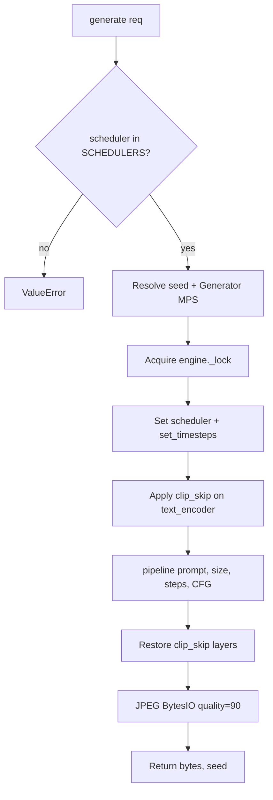
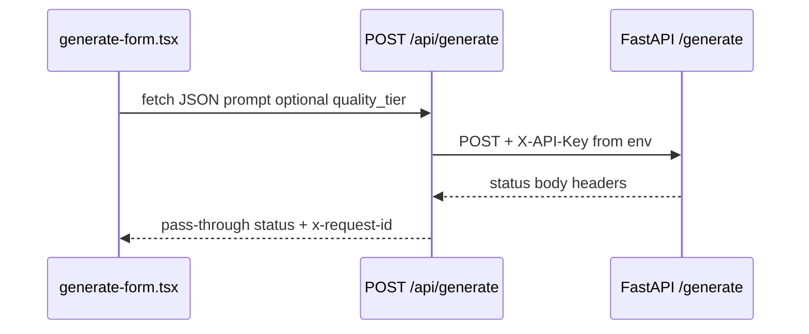
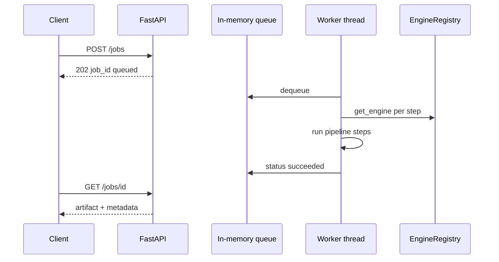

# Low-Level Design (LLD) — image-sd

Companion to [ARCHITECTURE.md](./ARCHITECTURE.md) (system context, roadmap, tech debt). This document specifies **modules, classes, HTTP contracts, concurrency, and sequences** as implemented or planned in-repo.

**Scope:** `services/inference-api/` + `apps/web/` proxy.  
**Runtime target (MVP):** macOS Apple Silicon, MPS, local weights at `models/sdxl-base`.  
**Production target:** GPU VM (e.g. Spheron), CUDA, same HTTP contract.

---

## 1. Component diagram



---

## 2. Module dependency graph



| Module | Depends on | Must not depend on |
|--------|------------|-------------------|
| `schemas.py` | pydantic only | torch, diffusers, FastAPI |
| `router.py` | `schemas` | torch, FastAPI |
| `engine.py` | torch, diffusers, `schemas` | FastAPI Request/Response |
| `registry.py` | `engine` | FastAPI |
| `main.py` | FastAPI, `schemas`, `router`, `registry`/`engine` | diffusers pipeline internals |
| `client.py` | httpx/requests | — |

---

## 3. Class diagram (inference service)



---

## 4. HTTP surface

| Method | Path | Auth | Response |
|--------|------|------|----------|
| `GET` | `/health` | No | `200` engine status JSON |
| `GET` | `/metrics` | `X-API-Key` | `200` counters |
| `POST` | `/generate` | `X-API-Key` | `200` / `401` / `422` / `429` / `500` / `504` |
| `POST` | `/jobs` | `X-API-Key` | `202` / `401` / `429` |
| `GET` | `/jobs/{job_id}` | `X-API-Key` | `200` / `401` / `404` |
| — | `/docs` | No | OpenAPI UI |

### 4.1 Stable `error_code` values (product surface)

| HTTP | `error_code` | When |
|------|----------------|------|
| 401 | `unauthorized` | Missing/wrong API key |
| 422 | (validation) | Pydantic / unknown fields |
| 422 | `unsupported_model_id` | Registry rejects `model_id` |
| 404 | `job_not_found` | Unknown `job_id` on `GET /jobs/{id}` |
| (job body) | `convergence_failed` | Job `status=failed` after max iterations |
| 429 | `rate_limited` | Per-key sliding window exceeded |
| 429 | `capacity_reached` | Semaphore `MAX_INFLIGHT_GENERATIONS` |
| 500 | `internal_error` | Unhandled exception |
| 504 | `generation_timeout` | `asyncio.wait_for` exceeded |

### 4.2 Success metadata keys (`POST /generate`)

| Key | Source |
|-----|--------|
| `prompt`, `width`, `height`, `steps`, `guidance_scale`, `clip_skip`, `scheduler` | Effective request after tier routing |
| `seed` | Engine return value |
| `model_id` | `router.DEFAULT_MODEL_ID` today (`sdxl_base`) |
| `quality_tier` | Original client field (may be `null`) |

---

## 5. Configuration

| Variable | Where read | Default | Purpose |
|----------|------------|---------|---------|
| `SDXL_MODEL_PATH` | `main.py` | `<repo>/models/sdxl-base` | Weight directory |
| `SDXL_API_KEY` | `main.py` | `dev-local-key` | Expected `X-API-Key` |
| `APP_ENV` | `main.py` | `dev` | Include `details` on 500 if `dev` |
| `PORT` | Makefile | `8001` | Uvicorn port |
| `SDXL_API_URL` | `apps/web` route | `http://127.0.0.1:8001/generate` | Upstream URL |
| `SDXL_API_KEY` | `apps/web` route | `dev-local-key` | Server-side proxy key |

### Constants (`main.py`)

| Name | Value | Role |
|------|-------|------|
| `MAX_INFLIGHT_GENERATIONS` | `1` | Semaphore cap (Mac MVP) |
| `GENERATION_TIMEOUT_SECONDS` | `90` | Wall-clock cap on executor wait |
| `RATE_LIMIT_REQUESTS` | `5` | Per-key max in window |
| `RATE_LIMIT_WINDOW_SECONDS` | `60` | Sliding window size |

### Quality tier table (`router.py`)

| `quality_tier` | `steps` | `guidance_scale` | `model_id` |
|----------------|---------|------------------|------------|
| `fast` | 12 | 5.0 | `sdxl_base` |
| `balanced` | 25 | 6.0 | `sdxl_base` |
| `quality` | 35 | 7.0 | `sdxl_base` |
| *(omit)* | client defaults | client defaults | `sdxl_base` |

---

## 6. Sequence — `POST /generate` success path



---

## 7. Sequence — policy rejections (before GPU)



---

## 8. Concurrency and threading model



| Concern | Mechanism | Note |
|---------|-----------|------|
| Event loop blocking | `run_in_executor` | Inference never on main loop |
| Concurrent `/generate` | `Semaphore(1)` | Second request → `capacity_reached` |
| Metrics | `_metrics_lock` | Counter updates |
| Pipeline mutation | `SDXLEngine._lock` | Scheduler / clip_skip per request |
| Engine cache | `EngineRegistry._lock` | Lazy create under lock |
| Timeout | `wait_for(90s)` | Does **not** cancel GPU thread |

---

## 9. `SDXLEngine.generate` internal flow



---

## 10. Next.js proxy (`apps/web`)



| Concern | Design |
|---------|--------|
| API key | Server-only `SDXL_API_KEY`, never `NEXT_PUBLIC_` |
| Body | Transparent JSON forward |
| Errors | Upstream JSON + status preserved |

---

## 11. State: implementation vs planned

```mermaid
flowchart LR
    subgraph Done["Implemented"]
        D1[schemas + tests]
        D2[main gates + metrics]
        D3[router quality_tier]
        D4[SDXLEngine MPS]
        D5[Next proxy + form]
    end

    subgraph Done2["Also implemented"]
        D6[EngineRegistry lazy load]
        D7[POST /jobs + GET /jobs/id]
        D8[evaluator + correction loop]
    end

    subgraph Planned["LLD target"]
        P1[inpaint engine + mask pipeline]
        P2[VLM rubric evaluator]
        P3[planner over tools]
        P4[DEVICE=cuda Spheron]
    end

    Done --> Done2
    Done2 --> Planned
```



---

## 12. Correction jobs (implemented MVP)

In-process worker (`jobs.py`); state is **lost on process restart**.

### HTTP

| Method | Path | Success | Notes |
|--------|------|---------|-------|
| POST | `/jobs` | 202 | Body: `JobCreateRequest` (`goal`, `prompt`, `quality_tier`, `max_iterations`) |
| GET | `/jobs/{job_id}` | 200 | `JobStatusResponse`; 404 `job_not_found` |

### Schemas (additive)

- `VisualGoal` — model-agnostic intent (`realism`, `preserve_product`, `task`)
- `JobCreateRequest`, `JobCreateResponse`, `JobStatusResponse`, `JobIterationRecord`, `EvalResult`

### Modules

| Module | Role |
|--------|------|
| `evaluator.py` | Rules + optional CLIP when `reference_image_base64` set |
| `clip_evaluator.py` | Lazy CLIP (`CLIP_MODEL_ID`, `CLIP_DEVICE`, `PRODUCT_SIMILARITY_MIN`) |
| `correction.py` | Maps `issues[]` → policy patch (tier bump); no raw CFG |
| `sdxl_adapter.py` | `effective_request`, `build_metadata`, `bump_quality_tier` |
| `generation_service.py` | Shared `generate_image_bytes` for `/generate` and jobs |
| `capabilities.py` | Manifest: which `model_id` supports which capability |
| `jobs.py` | Store, schedule, `generate → evaluate → correct` loop |

### Sequence



---

## 13. Testing map

| Test module | Layer | GPU |
|-------------|-------|-----|
| `tests/test_router.py` | `apply_quality_tier` | No |
| `tests/test_integration_api.py` | ASGI HTTP contract | Mocked `SDXLEngine` |

Integration tests patch `SDXLEngine.load_model` / `generate` at import time. When `main.py` uses `registry`, tests should mock `registry.get_engine` (see Phase 1 wiring).

---

## 14. File layout (inference-api)

```text
services/inference-api/
├── main.py               # HTTP, /generate, /jobs, metrics
├── schemas.py            # Pydantic contracts (+ job/goal types)
├── router.py             # quality_tier → steps/CFG/model_id
├── registry.py           # Engine lifecycle (lazy cache)
├── sdxl_adapter.py       # Policy → effective GenerateRequest
├── generation_service.py # Shared async generate
├── evaluator.py          # Goal vs output (rules + CLIP)
├── clip_evaluator.py     # CLIP similarity (lazy load)
├── correction.py         # issues → policy patch
├── capabilities.py       # model_id capability manifest
├── jobs.py               # Correction job store + worker
├── engine.py             # diffusers SDXL on MPS
├── client.py             # Sample HTTP client
└── tests/
    ├── test_integration_api.py
    ├── test_router.py
    ├── test_evaluator.py
    ├── test_correction.py
    └── test_clip_evaluator.py
```

---

## 15. Benchmark harness

| Path | Role |
|------|------|
| `benchmarks/product_similarity/manifest.json` | Case list: `id`, `prompt`, `reference_path`, optional overrides |
| `benchmarks/product_similarity/fixtures/` | Reference JPEGs (not in git until you add them) |
| `scripts/run_product_benchmark.py` | HTTP client: baseline vs job, writes `results/latest.json` |
| `make benchmark-product` | Runs script (requires live API + fixtures) |

Integration test: `tests/test_benchmark_manifest.py` (schema only, no GPU).

---

## 16. Related documents

| Document | Contents |
|----------|----------|
| [README.md](./README.md) | Setup, curl, env, runbooks |
| [ARCHITECTURE.md](./ARCHITECTURE.md) | System context, target diagrams, tech debt, Spheron |
| [.cursor/rules/](./.cursor/rules/) | Merge checklist, monorepo boundaries |
