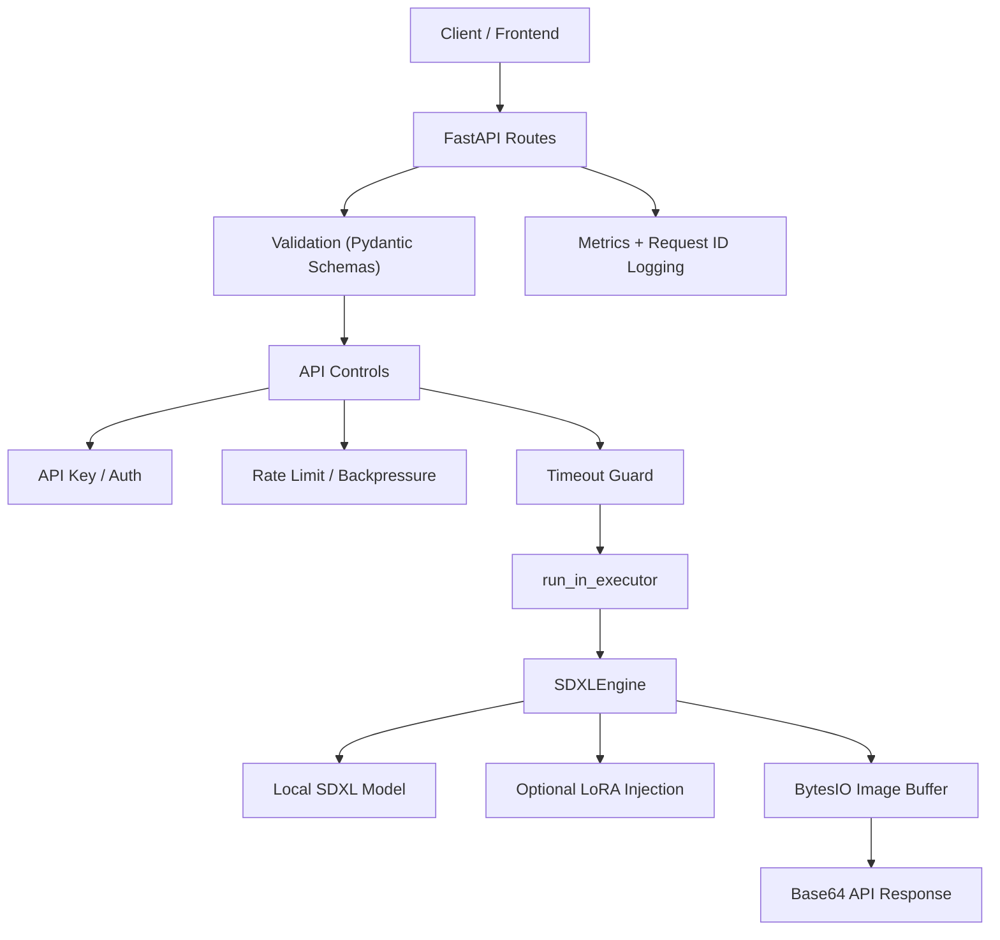

# SDXL Image API

Local FastAPI service for SDXL image generation on Apple Silicon using MPS.

## Collaboration Notes

This repository is intentionally code-only for collaboration.

- `models/` is not tracked in git
- `generated/` is not tracked in git
- teammates should pull the repo first, then download model assets locally

### Working Agreement

- Backend contract lives in `main.py`, `schemas.py`, and integration tests
- Inference implementation lives in `engine.py`
- Large model files stay out of git history
- Product changes should preserve the current error and metrics contracts unless intentionally versioned

### System Flow



### Cofounder Setup

1. Clone the repository.
2. Create and activate `.venv`.
3. Install dependencies.
4. Download the SDXL model locally into `./models/sdxl-base`.
5. Run `make test-integration`.
6. Start the API with `make run`.

## Requirements

- macOS with Apple Silicon
- Python virtual environment at `.venv`
- Local model files under `./models/sdxl-base`

## Activate Environment

```bash
cd /Users/kiran-giga-se/Desktop/kk/img/image-sd
source .venv/bin/activate
```

## Start the Server

```bash
uvicorn main:app --host 127.0.0.1 --port 8000 --reload
```

The API will be available at:

```text
http://127.0.0.1:8000
```

## Health Check

Use this to confirm the engine is loaded:

```bash
curl http://127.0.0.1:8000/health
```

Expected response:

```json
{"status":"healthy","engine":"mps","backend":"diffusers","optimization":"lightning"}
```

## Metrics

Use this to inspect basic runtime counters and generation latency:

```bash
curl http://127.0.0.1:8000/metrics
```

## Backpressure Behavior

When `MAX_INFLIGHT_GENERATIONS` is reached, new `/generate` requests should return `429` instead of queueing forever.

Run two generation requests in parallel:

```bash
curl -s -X POST "http://127.0.0.1:8000/generate" \
  -H "Content-Type: application/json" \
  -d '{"prompt":"request one"}' >/tmp/r1.json &
curl -s -X POST "http://127.0.0.1:8000/generate" \
  -H "Content-Type: application/json" \
  -d '{"prompt":"request two"}' >/tmp/r2.json &
wait
cat /tmp/r1.json
cat /tmp/r2.json
```

Then verify rejection counters:

```bash
curl -s http://127.0.0.1:8000/metrics
```

Look for:

- `generate_rejected_total` increasing when capacity is exceeded
- `generate_inflight` returning to `0` after requests complete

## Generate an Image

The `/generate` endpoint returns a JSON response with a Base64-encoded image.

```bash
curl -X POST "http://127.0.0.1:8000/generate" \
  -H "Content-Type: application/json" \
  -d '{
    "prompt":"a cinematic portrait of a tiger in rain, ultra detailed",
    "width":1024,
    "height":1024,
    "steps":4,
    "guidance_scale":1.0,
    "scheduler":"dpm++2m_karras",
    "seed":1234
  }'
```

Each response also includes an `X-Request-ID` header for tracing.

## Request Fields

- `prompt`: text prompt for the image
- `negative_prompt`: optional negative prompt
- `seed`: optional manual seed
- `width`: image width, `512` to `1536`, multiple of `8`
- `height`: image height, `512` to `1536`, multiple of `8`
- `steps`: default `4`, allowed `1` to `8`
- `guidance_scale`: default `1.0`, allowed `0.0` to `2.0`
- `clip_skip`: default `2`
- `scheduler`: `dpm++2m_karras` or `euler`
- `lora_path`: optional local `.safetensors` path
- `lora_scale`: optional LoRA strength

## Save the Returned Image

Because the API returns Base64, use the helper client or decode the response yourself.

Run the sample client:

```bash
python client.py
```

Or decode manually in Python:

```bash
python - <<'PY'
import requests
import base64

response = requests.post(
    "http://127.0.0.1:8000/generate",
    json={"prompt": "a cinematic portrait of a tiger in rain"}
)
response.raise_for_status()
data = response.json()

with open("output.jpg", "wb") as f:
    f.write(base64.b64decode(data["image_base64"]))

print("Saved output.jpg")
PY
```

## API Docs

Interactive Swagger UI:

```text
http://127.0.0.1:8000/docs
```

## Integration Tests

Run the full integration suite:

```bash
cd /Users/kiran-giga-se/Desktop/kk/img/image-sd
source .venv/bin/activate
python -m unittest discover -s tests -p 'test_*.py' -v
```

The tests use ASGI integration calls with mocked model loading/generation so they validate API behavior without GPU-heavy startup.

## Model Notes

- The service loads the local model from `./models/sdxl-base`
- Loading is offline-only; it does not download model files at runtime
- The code uses fp16 safetensors on MPS

## Common Issues

If startup fails because model files are missing, verify these exist:

```text
./models/sdxl-base/model_index.json
./models/sdxl-base/unet/diffusion_pytorch_model.fp16.safetensors
./models/sdxl-base/vae/diffusion_pytorch_model.fp16.safetensors
./models/sdxl-base/text_encoder/model.fp16.safetensors
./models/sdxl-base/text_encoder_2/model.fp16.safetensors
```

If `GET /` returns `404 Not Found`, that is expected. Use `/health`, `/docs`, or `POST /generate`.
