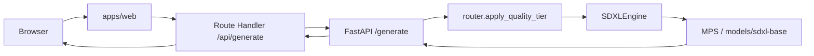

# SDXL Image API

Monorepo for **local SDXL image generation** on Apple Silicon (MPS) and a **Next.js** UI. The FastAPI service owns the HTTP contract; the web app proxies requests so API keys stay on the server.

**Design docs:** [ARCHITECTURE.md](./ARCHITECTURE.md) (system context, roadmap) · [LLD.md](./LLD.md) (modules, sequences, contracts, Mermaid diagrams).

## Repository layout

| Path | Purpose |
|------|---------|
| `services/inference-api/` | FastAPI: `main.py`, `engine.py`, `router.py`, `schemas.py`, `tests/` |
| `apps/web/` | Next.js App Router UI + `POST /api/generate` proxy |
| `packages/` | Optional shared TS types / constants (empty until needed) |
| `.cursor/rules/` | Cursor project rules (monorepo, Python, quality bar) |
| `models/` | Local SDXL weights (**gitignored**) at `models/sdxl-base` |

### Source tree (tracked in git)

```text
image-sd/
├── benchmarks/product_similarity/   # CLIP benchmark manifest + fixtures
├── scripts/run_product_benchmark.py
├── .cursor/rules/
├── apps/web/
│   ├── src/app/              # pages + api/generate route
│   ├── src/components/       # generate form
│   └── .env.example
├── packages/                 # optional shared TS (empty)
├── services/inference-api/
│   ├── client.py
│   ├── engine.py
│   ├── main.py
│   ├── router.py
│   ├── registry.py
│   ├── sdxl_adapter.py
│   ├── evaluator.py
│   ├── clip_evaluator.py
│   ├── correction.py
│   ├── jobs.py
│   ├── schemas.py
│   └── tests/
│       ├── test_integration_api.py
│       ├── test_router.py
│       ├── test_evaluator.py
│       ├── test_correction.py
│       └── test_clip_evaluator.py
├── ARCHITECTURE.md
├── LLD.md
├── Makefile
├── requirements.txt          # Python lockfile (see Install)
└── README.md
```

**Not in git:** `.venv/`, `models/`, `generated/`, `apps/web/node_modules/`, `apps/web/.next/`, `.env` / `.env.local`, local `*.jpg` outputs.

## Quick start (API + web)

### 1. Python inference API

From the repository root:

```bash
python -m venv .venv
source .venv/bin/activate
uv pip install -r requirements.txt
uv pip install diffusers uvicorn accelerate   # if not already present in your env
```

Download weights into `./models/sdxl-base` (see [Download model](#download-model-locally)).

```bash
make test-integration
make run
```

API: `http://127.0.0.1:8001` — docs at `/docs`, health at `/health`.

### 2. Next.js web app

In a second terminal:

```bash
cd apps/web
cp .env.example .env.local   # adjust SDXL_API_URL / SDXL_API_KEY if needed
npm install
npm run dev
```

Open `http://localhost:3000`, enter a prompt, and generate. The UI calls `/api/generate`, which forwards to the inference API with `X-API-Key` on the server.

## System flow (today)

**Single shot:** browser → Next proxy → `POST /generate` → tier policy → SDXL → Base64 JSON.

**Correction loop:** `POST /jobs` → worker runs generate → evaluate → bump tier if needed → `GET /jobs/{id}` when `converged` or `failed`. See [ARCHITECTURE.md](./ARCHITECTURE.md#correction-loop-first-mvp).



## Requirements

- macOS with Apple Silicon (MVP target)
- Python 3.12+ in `.venv` at repo root
- Node.js 20+ for `apps/web`
- Local model files under `./models/sdxl-base`

## Install dependencies (Python)

With `uv` and an activated `.venv`:

```bash
uv pip install -r requirements.txt
```

The root `requirements.txt` is a broad environment lockfile. Inference needs **diffusers** and **uvicorn**; install them if imports fail:

```bash
uv pip install diffusers uvicorn accelerate
```

Minimal inference-only set (fresh venv):

```bash
uv pip install fastapi uvicorn torch diffusers transformers accelerate pydantic pillow huggingface_hub httpx requests
```

## Download model locally

Weights are **not** in git. Each machine needs **SDXL base 1.0** at `./models/sdxl-base`:

```bash
python -c "from huggingface_hub import snapshot_download; snapshot_download(repo_id='stabilityai/stable-diffusion-xl-base-1.0', local_dir='./models/sdxl-base', allow_patterns=['model_index.json','scheduler/*','tokenizer/*','tokenizer_2/*','text_encoder/config.json','text_encoder/model.fp16.safetensors','text_encoder_2/config.json','text_encoder_2/model.fp16.safetensors','vae/config.json','vae/diffusion_pytorch_model.fp16.safetensors','unet/config.json','unet/diffusion_pytorch_model.fp16.safetensors'])"
```

**Note:** Defaults and `quality_tier` profiles are tuned for **base SDXL** (more steps, higher CFG). `/health` may still report `"optimization": "lightning"` — that field is legacy; actual weights are base 1.0.

Override model path: `SDXL_MODEL_PATH=/path/to/weights make run`.

## Start the inference server

```bash
make run
```

Or manually:

```bash
cd services/inference-api && source ../../.venv/bin/activate && uvicorn main:app --host 127.0.0.1 --port 8001 --reload
```

Default port **8001** (`PORT=8000 make run` to override).

## Health check

```bash
curl http://127.0.0.1:8001/health
```

Example:

```json
{"status":"healthy","engine":"mps","backend":"diffusers","optimization":"lightning"}
```

## Metrics

```bash
curl http://127.0.0.1:8001/metrics -H "X-API-Key: dev-local-key"
```

## API key authentication

- `/generate` and `/metrics` require header `X-API-Key`.
- Default dev key: `dev-local-key` (override with `SDXL_API_KEY` before `make run`).
- Next.js reads the same values from `apps/web/.env.local` (`SDXL_API_KEY`, `SDXL_API_URL`) — never expose the key to the browser.

## Generate an image

### With `quality_tier` (recommended for base SDXL)

The server sets `steps` and `guidance_scale` from `services/inference-api/router.py`:

| Tier | Steps | Guidance |
|------|-------|----------|
| `fast` | 12 | 5.0 |
| `balanced` | 25 | 6.0 |
| `quality` | 35 | 7.0 |

```bash
curl -sS -X POST "http://127.0.0.1:8001/generate" \
  -H "Content-Type: application/json" \
  -H "X-API-Key: dev-local-key" \
  -d '{
    "prompt": "a cinematic portrait of a tiger in rain, ultra detailed",
    "quality_tier": "balanced",
    "width": 1024,
    "height": 1024,
    "seed": 1234
  }'
```

### Explicit steps (no tier override)

```bash
curl -sS -X POST "http://127.0.0.1:8001/generate" \
  -H "Content-Type: application/json" \
  -H "X-API-Key: dev-local-key" \
  -d '{
    "prompt": "a red apple on a wooden table",
    "steps": 25,
    "guidance_scale": 6.0,
    "scheduler": "dpm++2m_karras"
  }'
```

Success responses include `image_base64` and `metadata` (`steps`, `guidance_scale`, `model_id`, `quality_tier`, `seed`, …). Responses include header `X-Request-ID`.

| Variable | Default | Description |
|----------|---------|-------------|
| `GENERATION_TIMEOUT_SECONDS` | `90` | Wall-clock cap per generate step (jobs run multiple steps) |
| `SDXL_API_KEY` | `dev-local-key` | API key for `/generate`, `/metrics`, `/jobs` |
| `SDXL_MODEL_PATH` | `<repo>/models/sdxl-base` | Weight directory |
| `APP_ENV` | `dev` | `dev` includes error `details` on 500 |
| `CLIP_MODEL_ID` | `openai/clip-vit-base-patch32` | Hugging Face model for job reference eval |
| `CLIP_DEVICE` | `cpu` | Device for CLIP (keep `cpu` on Mac if MPS busy with SDXL) |
| `PRODUCT_SIMILARITY_MIN` | `0.85` | Default CLIP threshold when `goal.product_similarity_min` unset |

On Mac, use `export GENERATION_TIMEOUT_SECONDS=300` before `make run` when using `balanced` / `quality` tiers or multi-step jobs.

Watch logs for `generation_timeout` (504). Note: timeout ends the HTTP wait; GPU work may still finish in the background (see ARCHITECTURE.md).

## Request fields

| Field | Description |
|-------|-------------|
| `prompt` | Required text prompt |
| `negative_prompt` | Optional; default anti-artifact string |
| `seed` | Optional; random if omitted |
| `width` / `height` | 512–1536, multiple of 8; default 1024 |
| `steps` | 1–40; default 4 (use tier or raise for base SDXL) |
| `guidance_scale` | 0.0–12.0; default 1.0 |
| `quality_tier` | Optional: `fast`, `balanced`, `quality` — overrides steps/CFG |
| `clip_skip` | 1–4; default 2 |
| `scheduler` | `dpm++2m_karras` or `euler` |

Unknown fields (e.g. `lora_path`) return **422**.

## Correction jobs (`POST /jobs`)

Goal-seeking generation with bounded retries (policy correction, not LLM planner).

```bash
# Create job (202) — tier-only correction
curl -sS -X POST "http://127.0.0.1:8001/jobs" \
  -H "Content-Type: application/json" \
  -H "X-API-Key: dev-local-key" \
  -d '{
    "goal": { "realism": "high" },
    "prompt": "photorealistic portrait, soft natural light",
    "quality_tier": "fast",
    "max_iterations": 3
  }'

# Product reference (CLIP similarity) — set preserve_product or product_similarity_min
# reference_image_base64: base64-encoded JPEG of your product SKU photo
curl -sS -X POST "http://127.0.0.1:8001/jobs" \
  -H "Content-Type: application/json" \
  -H "X-API-Key: dev-local-key" \
  -d '{
    "goal": { "preserve_product": true, "product_similarity_min": 0.85 },
    "prompt": "luxury ring on velvet, studio lighting",
    "quality_tier": "fast",
    "max_iterations": 3,
    "reference_image_base64": "<BASE64_JPEG>"
  }'

# Poll (replace JOB_ID)
curl -sS "http://127.0.0.1:8001/jobs/JOB_ID" -H "X-API-Key: dev-local-key"
```

| Job `status` | Meaning |
|--------------|---------|
| `queued` / `running` | In progress |
| `converged` | Evaluator passed; `image_base64` set |
| `failed` | `error_code`: `convergence_failed` |
| `error` | e.g. `generation_timeout`, `capacity_reached` |

Response includes `iterations[]` (attempt, `issues`, `clip_similarity` when ref provided, tier/steps per try).

**Evaluator note:** v1 CLIP measures reference match, not full scene correctness. Tier bump is a coarse correction; inpaint pipeline is planned for localized fixes.

## Backpressure and rate limits

- **Capacity:** `MAX_INFLIGHT_GENERATIONS=1` → second concurrent `/generate` gets **429** `capacity_reached` with `Retry-After: 5`.
- **Rate limit:** per API key, sliding window → **429** `rate_limited`.

## Save the returned image

```bash
cd services/inference-api && source ../../.venv/bin/activate && python client.py
```

Or decode JSON with Python/`base64` (outputs are gitignored if written beside the service).

## Integration tests

```bash
make test-integration
```

Runs `test_integration_api.py` and `test_router.py` with **mocked** GPU work.

## Product benchmark (hypothesis test)

Prove whether the **job loop** beats **single-shot** `/generate` on CLIP vs a product reference (not human QA).

1. Add SKU JPEGs under `benchmarks/product_similarity/fixtures/` (see `manifest.json`).
2. `make run` with `GENERATION_TIMEOUT_SECONDS=300`.
3. `make benchmark-product`
4. Read `benchmarks/product_similarity/results/latest.md`.

Coach guide: [benchmarks/product_similarity/README.md](./benchmarks/product_similarity/README.md).

## Web app (`apps/web`)

From repo root, in a second terminal:

```bash
cd apps/web
cp .env.example .env.local
npm install
npm run dev
```

- UI: `http://localhost:3000`
- Server route `src/app/api/generate/route.ts` proxies to `SDXL_API_URL` with `X-API-Key` from env
- Client: `src/components/generate-form.tsx` — extend the POST body with `quality_tier` when you want tiered generation

## Collaboration notes

- Contract source of truth: `schemas.py` + integration tests.
- Inference only in `engine.py` (and future engine modules per `model_id`).
- Goal/intent types (`VisualGoal`) stay separate from adapter knobs (`steps`, `scheduler`).
- Contract changes → update tests, this README, and `ARCHITECTURE.md` when behavior meaning changes.

## Common issues

**Missing model files** — ensure `models/sdxl-base/model_index.json` and fp16 safetensors exist (see download command).

**504 timeout** — lower tier, reduce steps, or raise `GENERATION_TIMEOUT_SECONDS` for local dev.

**Blurry images with default `steps: 4`** — you are on **base** weights; use `quality_tier: "balanced"` or higher steps/CFG.

**Next cannot reach API** — inference must be on `127.0.0.1:8001`; check `apps/web/.env.local`.

**`GET /` returns 404** — use `/health`, `/docs`, or `POST /generate`.
